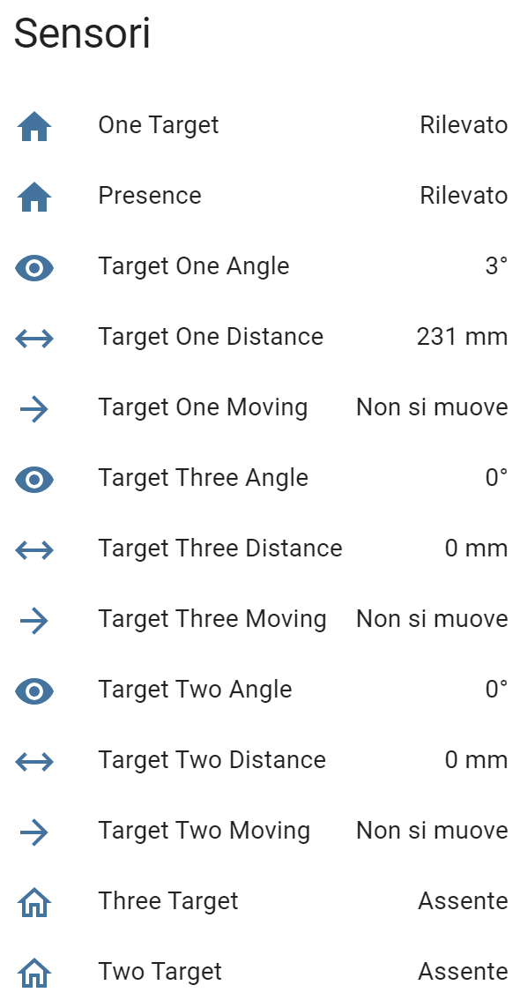
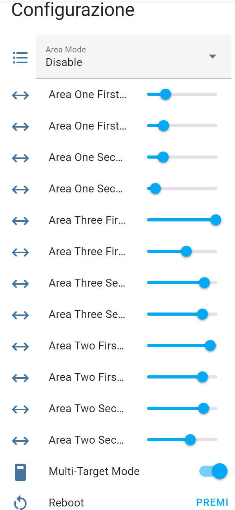

# ⚠️ Development Fork - Not for General Use

This is a development fork used for testing and experimentation. 

**For the official LD2450 BLE integration, please visit: https://github.com/MassiPi/ld2450_ble**

---

<!-- 

📋 Development Documentation (Click to expand)
 -->

# LD2450 BLE Integration for Home Assistant

A Home Assistant integration for the Hi-Link LD2450 24GHz mmWave Radar Presence Sensor over Bluetooth LE.

This integration extends Home Assistant's native Bluetooth integration capabilities to fully support the LD2450 radar sensor, including all configuration options and sensor data.

## Features

- **Automatic Discovery**: Seamless Bluetooth LE device discovery and configuration
- **Multi-Target Detection**: Real-time tracking of up to 3 simultaneous targets
- **Comprehensive Sensors**: Complete target data including position, speed, distance, angle, and direction
- **Zone Configuration**: Up to 3 configurable detection/filter zones with precise coordinate control
- **Device Management**: Restart and Factory Reset capabilities

## Installation

### HACS Installation (Preferred)

1. Make sure you have [HACS](https://hacs.xyz) installed in your Home Assistant instance
2. Add this repository as a custom repository in HACS:
   - Click the menu icon in the top right of HACS
   - Select "Custom repositories"
   - Add `MassiPI/ld2450_ble` as the repository URL
   - Select "Integration" as the category
3. Click "Download" on the LD2450 BLE integration
4. Restart Home Assistant

### Manual Installation

1. Download the latest release from this repository
2. Copy the `custom_components/ld2450_ble` folder to your Home Assistant's `custom_components` directory
3. Restart Home Assistant

## Configuration

The integration supports automatic discovery of LD2450 devices:

1. Go to Settings -> Devices & Services
2. Click "Add Integration"
3. Search for "LD2450 BLE"
4. The integration will automatically discover any LD2450 devices broadcasting over Bluetooth
5. Follow the prompts to complete setup

## Available Entities

### Sensors
- **Target Coordinates**: X,Y position for up to 3 targets
- **Target Speed**: Movement speed for each target
- **Target Distance**: Calculated distance from sensor
- **Target Angle**: Calculated angle from sensor
- **Target Direction**: Movement direction (Stationary, Moving away, Approaching, NA)
- **Target Resolution**: Detection resolution for each target

### Binary Sensors
- **Presence**: Overall presence detection
- **Moving Target**: Detects if any target is moving
- **Still Target**: Detects if any target is stationary
- **Individual Target Detection**: Separate sensors for Target 1, 2, and 3
- **Individual Target Movement**: Movement status for each target

### Configuration Entities
- **Multi-target Mode Switch**: Toggle between single and multi-target tracking
- **Zone Coordinates**: Rectangular zone definition for up to 3 zones using boundary coordinates:
  - **X1, X2**: Define the near and far boundaries of the zone (distance from sensor)
    - Range: 0mm to 8000mm (forward from sensor)
  - **Y1, Y2**: Define the left and right boundaries of the zone
    - Range: -5500mm to +5500mm (negative = left, positive = right)
  > 💡 Coordinate Tips: 
  > - You can enter coordinates in any order (X1/X2 and Y1/Y2 are interchangeable)
  > - The ranges are consistent with the HKLRadarTool app and device firmware v2.04.23101915 (your maximum and reliable detection distances may vary)
  > - Although this sensor is almost always depicted in a landscape orientation (even on the [official site and documetation](https://www.hlktech.net/index.php?id=1157)), it is indeed designed to be mounted in a **portrait** orientation
  > - If you are using the sensor in landscape, you will need to swap the X and Y coordinates
- **Zone Type Selector**: Configure zone behavior using the following options:
  - `Disabled` option will disable zone area detection
  - `Detection` mode is used to detect only targets in the zone(s) you define
  - `Filter` mode can be used to exclude those zones from detection
  > 💡 Note: The sensor does not allow setting the zone type for individual zones. All zones you configure will either be `Detection` zones or `Filter` zones
- **Restart Button**: Reboot the device
- **Factory Reset Button**: Reset all settings to factory defaults

## Entity Examples

&nbsp;

## Credits

This integration is based on:
- Home Assistant's official [LD2410 BLE integration](https://www.home-assistant.io/integrations/ld2410_ble/)
- Original Bluetooth protocol implementation from [930913/ld2410-ble](https://github.com/930913/ld2410-ble)
- Modified and extended for LD2450 support by [MassiPI](https://github.com/MassiPI)
- ESPHome's official [LD2450 Sensor Component](https://esphome.io/components/sensor/ld2450/)
- Lovelace Plotly Graph Card config derived from this Home Assistant Community thread: https://community.home-assistant.io/t/screek-human-sensor-2a-ld2450-24ghz-mmwave-human-tracker-sensor/603070/41

As a bonus, there is the 3d model for a sensor case (just print it..) (5 parts: sensor box (with text), back plate, 3-pieces-support to allow solid positioning of the sensor)

<!-- 
 -->
